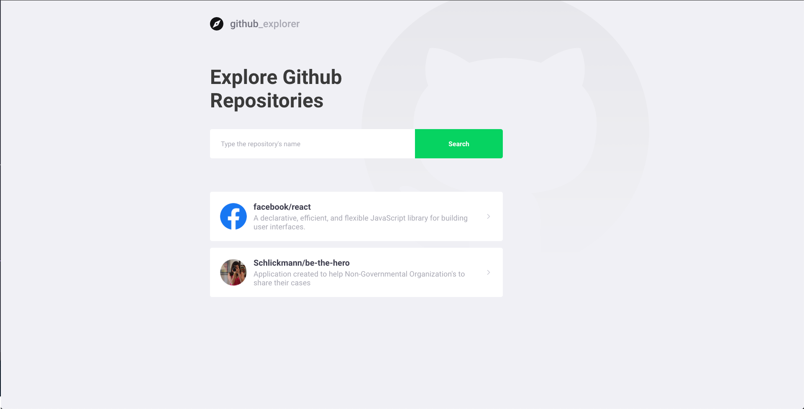
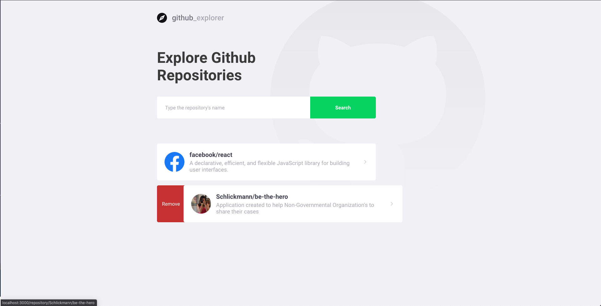
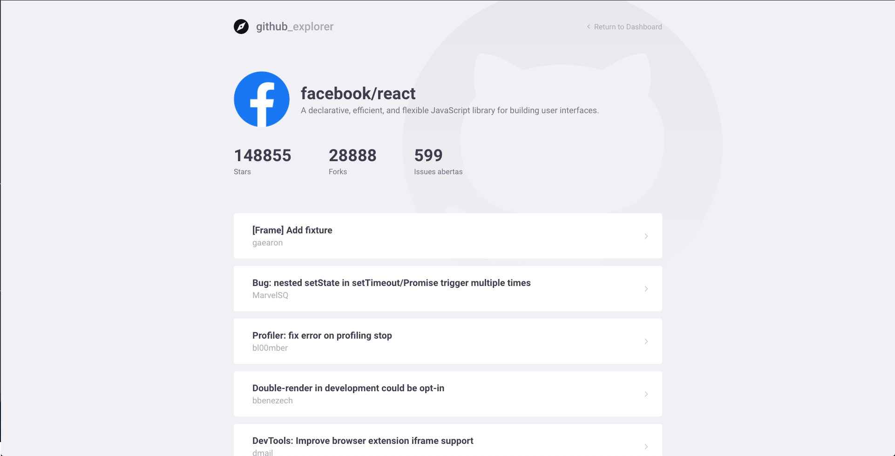

<h1 align="center">
    
</h1>

<h3 align="center">
  GitHub Explorer
</h3>

<h4 align="center"> 
	:construction: 🚀 Project In progress.. :construction:
</h4>

  

  
	
  

  

  

  

  <a href="#rocket-Technologies">Technologies</a>&nbsp;&nbsp;&nbsp;|&nbsp;&nbsp;&nbsp;
  <a href="#-project">Project</a>&nbsp;&nbsp;&nbsp;|&nbsp;&nbsp;&nbsp;
  <a href="#-layout">Layout</a>&nbsp;&nbsp;&nbsp;|&nbsp;&nbsp;&nbsp;
  <a href="#-how-to-contribute">How to contribute</a>&nbsp;&nbsp;&nbsp;|&nbsp;&nbsp;&nbsp;
  <a href="#memo-license">License</a>

 

## :rocket: Technologies

This project was developed with the following technologies:

- [React](https://reactjs.org)
- [Styled Components](https://styled-components.com/)
- [Typescript](https://www.typescriptlang.org/)
- [GitHub API](https://developer.github.com/v4/)

## 💻 Project

Github Explorer is an easy way to keep on tracking your favourites repositories.

- [Access Live App](https://github-explorer-schlickmann.netlify.app/)

## 🔖 Layout

<table>
  <tbody>
	 <tr>
	   <td></td>
	   <td></td>
	   <td></td>
	 </tr>
  </tbody>
</table>

## 🤔 How to contribute

- Make a fork;
- Create a branck with your feature: `git checkout -b my-feature`;
- Commit changes: `git commit -m 'feat: My new feature'`;
- Make a push to your branch: `git push origin my-feature`.

After merging your receipt request to done, you can delete a branch from yours.

## :memo: License

This project is under the MIT license. See the [LICENSE](LICENSE.md) for details.

---

Made with ♥ by Juliani Schlickmann :wave: [Get in touch!](https://www.linkedin.com/in/juliani-schlickmann-damasceno/)
